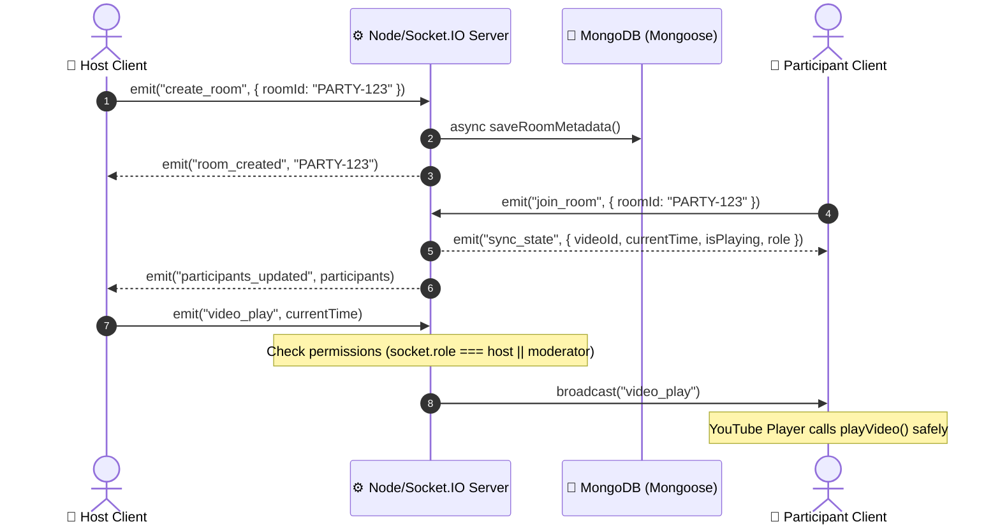

# 🎬 YouTube Watch Party — Real-Time Synchronized Cinema

[](https://nodejs.org/)
[](https://react.dev/)
[](https://socket.io/)
[](https://www.mongodb.com/)
[](LICENSE)

An application for creating real-time YouTube watch party rooms. Built with React, Node.js, Express, Socket.IO, and MongoDB, this platform enables users to watch YouTube videos in complete synchronization across multiple devices, featuring strict server-side role-based permission enforcement, live room chat, host transfers, and floating emoji reactions.

---

## 🌟 Key Features

### 🎬 Real-Time Playback Synchronization
- **Sub-Second Playback Sync**: Host/Moderator play, pause, and seek actions are broadcast instantly to all room participants.
- **Dynamic Late-Joiner Catch-Up**: New participants joining mid-video automatically receive the authoritative room state (video ID, computed current playback position, playing/paused state).
- **Infinite Loop & Feedback Prevention**: Dual-guard system with `remoteAction` flags and threshold-based seek detection prevents circular socket triggers and local state echoes.
- **YouTube IFrame API Integration**: Programmatically controls YouTube video playback and extracts video metadata.

### 🛡️ Role-Based Access Control (RBAC) & Server Security
- **Strict Server Validation**: All playback control (`video_play`, `video_pause`, `video_seek`, `load_video`), role management (`assign_role`, `transfer_host`), and user expulsion (`remove_participant`) are validated strictly on the Node.js backend.
- **Role Hierarchy**:
  - 👑 **Host**: Full room authority (load/change video, play/pause/seek, assign moderators, demote users, transfer host role, kick participants).
  - 🛡️ **Moderator**: Co-host privileges (load/change video, play/pause/seek). Cannot assign roles or kick participants.
  - 👤 **Participant**: Watch-only access with interactive chat and reactions. YouTube player controls are hidden or disabled on client.
- **Automatic Host Assignment**: If the Host disconnects, the server automatically transfers Host authority to the next active participant to prevent room lockouts.

### 🏠 Room System & Link Sharing
- **Unique Room Codes**: Support for custom room codes or auto-generated identifiers (e.g. `PARTY-9X82`).
- **Shareable URLs**: Auto-detects URL parameters (`?room=CODE`) so inviting friends automatically pre-fills room join fields.
- **1-Click Invite Copy**: Easily copy share links or room codes directly from the navigation bar.

### 💬 Live Room Chat & Emoji Reactions (Bonus Features)
- **Real-Time Room Chat**: In-room messaging with user role badges, message timestamps, auto-scroll, and sanitization.
- **Floating Emoji Reactions**: Interactive reaction bar (❤️, 🔥, 🎉, 😂, 👏, 👍) broadcasting real-time floating animations over the video player.

### 💾 Persistent MongoDB Database Architecture
- **Dual-Layer Architecture**: High-frequency real-time playback ticks remain in-memory via Socket.IO for sub-millisecond response times, while room lifecycle metadata and user roles asynchronously persist to MongoDB via Mongoose.
- **Graceful Fallback**: If MongoDB connection is unavailable, the server automatically falls back to in-memory store without breaking active watch parties.

### 💎 Modern Dark Glassmorphic UI/UX
- **Cinematic Dark Theme**: Ambient background glow, glassmorphic card overlays, responsive 16:9 aspect-ratio video player, and polished typography.
- **Glassmorphism Toast System**: Non-intrusive animated notification toasts for real-time state updates, permission alerts, and user events.
- **Interactive Modals**: Confirmation dialogs for destructive actions (Host transfer & participant removal).

---

## 📐 System Architecture



---

## 📊 Permission Matrix

| Action | 👑 Host | 🛡️ Moderator | 👤 Participant | Server Validated |
| :--- | :---: | :---: | :---: | :---: |
| Play / Pause / Seek | ✅ | ✅ | ❌ | **Yes** |
| Load / Change Video | ✅ | ✅ | ❌ | **Yes** |
| Promote to Moderator | ✅ | ❌ | ❌ | **Yes** |
| Demote to Participant | ✅ | ❌ | ❌ | **Yes** |
| Transfer Host Role | ✅ | ❌ | ❌ | **Yes** |
| Kick Participant | ✅ | ❌ | ❌ | **Yes** |
| Send Chat & Reactions | ✅ | ✅ | ✅ | **Yes** |

---

## 🔌 Socket.IO Event API Reference

### Client → Server Events
| Event Name | Payload | Description | Permission Required |
| :--- | :--- | :--- | :--- |
| `create_room` | `{ roomId, username }` | Creates a new watch party room | Public |
| `join_room` | `{ roomId, username }` | Joins an existing room | Public |
| `load_video` / `change_video` | `videoId` (string) | Changes the current YouTube video | Host / Moderator |
| `video_play` | `currentTime` (number) | Triggers playback across room | Host / Moderator |
| `video_pause` | `currentTime` (number) | Pauses playback across room | Host / Moderator |
| `video_seek` | `currentTime` (number) | Seeks to timestamp across room | Host / Moderator |
| `assign_role` | `{ userId, role }` | Changes a user's role | Host Only |
| `transfer_host` | `targetUserId` (string) | Transfers room ownership | Host Only |
| `remove_participant` | `userId` (string) | Expels a participant from room | Host Only |
| `send_chat_message` | `text` (string) | Broadcasts chat message | All Room Members |
| `send_reaction` | `emoji` (string) | Broadcasts floating emoji reaction | All Room Members |

### Server → Client Events
| Event Name | Payload | Description |
| :--- | :--- | :--- |
| `room_created` | `roomId` | Confirms room creation |
| `room_joined` | `roomId` | Confirms room join |
| `sync_state` | `{ videoId, currentTime, isPlaying, role }` | Full room state snapshot for joiners |
| `video_loaded` | `videoId` | Broadcasts new loaded video |
| `video_play` | *None* | Triggers local player play |
| `video_pause` | *None* | Triggers local player pause |
| `video_seek` | `currentTime` | Triggers local player seek |
| `participants_updated` | `Array<Participant>` | Updated list of connected users |
| `role_updated` | `newRole` | Updates client's assigned role |
| `host_transferred` | `{ newHostId, newHostName }` | Notifies room of new Host |
| `participant_removed` | *None* | Notifies client they were kicked |
| `chat_message` | `{ id, username, role, message, timestamp }` | Real-time chat message |
| `reaction_received` | `{ emoji, username }` | Triggers floating emoji animation |
| `permission_denied` | `message` | Error alert for unauthorized action |

---

## 🛠️ Project Structure

```
YouTube_Watch_Party/
├── client/
│   ├── public/
│   ├── src/
│   │   ├── components/
│   │   │   └── YouTubePlayer.jsx     # Synchronized YouTube API Component
│   │   ├── App.jsx                   # Main React Watch Party Interface & State
│   │   ├── App.css                   # Custom Animations & Scrollbars
│   │   ├── index.css                 # Base TailwindCSS setup
│   │   ├── main.jsx                  # React DOM Entrypoint
│   │   └── socket.js                 # Dynamic Socket.IO Client Configuration
│   ├── .env.example                  # Frontend environment variables template
│   ├── index.html
│   ├── package.json
│   └── vite.config.js
└── server/
    ├── config/
    │   └── database.js               # Mongoose MongoDB Connection Configuration
    ├── models/
    │   └── Room.js                   # Persistent Room Schema
    ├── services/
    │   └── roomService.js            # Asynchronous DB Storage Service
    ├── .env.example                  # Backend environment variables template
    ├── package.json
    └── server.js                     # Express + Socket.IO Server & Event Handlers
```

---

## 🚀 Getting Started

### Prerequisites
- **Node.js**: v18.0.0 or higher
- **npm**: v9.0.0 or higher
- **MongoDB** *(Optional)*: Local instance or MongoDB Atlas connection string.

### 1. Clone & Install Dependencies

```bash
# Clone the repository
git clone https://github.com/RamanshAgarwal/YouTube_Watch_Party.git
cd YouTube_Watch_Party

# Install backend dependencies
cd server
npm install

# Install frontend dependencies
cd ../client
npm install
```

### 2. Configure Environment Variables

#### Backend (`server/.env`):
Create a `.env` file inside the `server/` directory:
```env
PORT=5000
CLIENT_URL=http://localhost:5173
MONGODB_URI=mongodb://localhost:27017/youtube_watch_party
```

#### Frontend (`client/.env`):
Create a `.env` file inside the `client/` directory:
```env
VITE_SERVER_URL=http://localhost:5000
```

### 3. Run Development Servers

#### Start Backend Server:
```bash
cd server
node server.js
# Output:
# 🚀 Watch Party Server running on port 5000
# ℹ️ MONGODB_URI provided -> ✅ MongoDB Connected
```

#### Start Frontend Client:
```bash
cd client
npm run dev
# Output:
#  VITE v8.3.1 ready in 250 ms
#  ➜ Local: http://localhost:5173/
```

Open `http://localhost:5173` in multiple browser windows or tabs to simulate multi-user watch parties!

---


## 🌐 Live Demo

🚀 **Live Application:** https://youtube-watch-party-client-lduo.onrender.com

The application is publicly deployed and can be accessed using the link above.


## 🌐 Production Deployment Guide

### Deploying Backend (Render / Railway)
1. Push your repository to GitHub.
2. Create a new **Web Service** on Render or Railway.
3. Root Directory: `server`
4. Build Command: `npm install`
5. Start Command: `node server.js`
6. Add Environment Variables:
   - `PORT`: `5000`
   - `CLIENT_URL`: `https://your-frontend.vercel.app`
   - `MONGODB_URI`: `mongodb+x://your-mongodb-atlas-url`

### Deploying Frontend (Vercel / Netlify)
1. Create a new project on Vercel or Netlify.
2. Root Directory: `client`
3. Framework Preset: `Vite`
4. Build Command: `npm run build`
5. Output Directory: `dist`
6. Add Environment Variable:
   - `VITE_SERVER_URL`: `https://your-backend.onrender.com`

---

## 🧪 Verification & Manual Testing Checklist

- [x] **Room Creation**: Host creates room with custom ID or auto-generated code.
- [x] **Room Joining**: Participants join via Room Code or shareable URL link (`?room=CODE`).
- [x] **Host Playback Sync**: Host plays video -> all participants play synchronously.
- [x] **Host Pause Sync**: Host pauses video -> all participants pause synchronously.
- [x] **Host Seek Sync**: Host seeks video timeline -> all participants update to exact time.
- [x] **Video Loading**: Host loads new YouTube video -> all participants receive new video.
- [x] **Participant Restriction**: Participant attempting playback control gets server permission error.
- [x] **Role Promotion**: Host promotes Participant to Moderator. Moderator gains playback controls.
- [x] **Host Transfer**: Host transfers ownership to Moderator/Participant. Server updates roles and permissions immediately.
- [x] **Participant Expulsion**: Host kicks participant. Target user receives notification and leaves room.
- [x] **Automatic Host Reassignment**: Disconnecting Host automatically passes Host role to remaining member.
- [x] **Live Room Chat**: Chat messages render in real-time with role badges and auto-scroll.
- [x] **Floating Emoji Reactions**: Floating emojis animate cleanly across YouTube screen.

---

## 📄 License
This project is open-source and available under the [MIT License](LICENSE).
